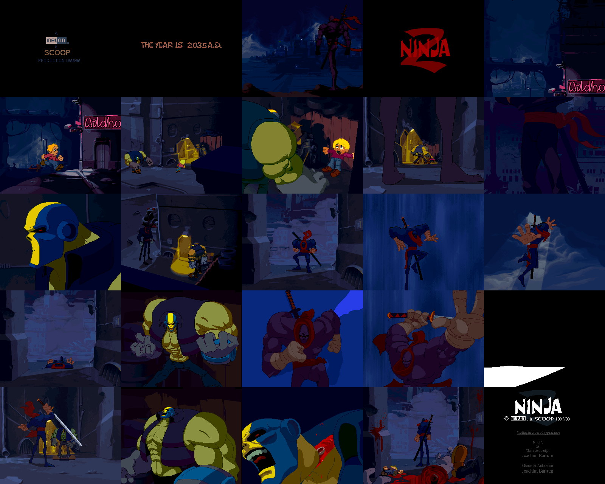

# Ninja 2 — in a browser

**▶ [Watch it in your browser](https://gmegidish.github.io/ninja2/)** · press **F** for fullscreen

*Ninja 2* is a demo by SCOOP and Melon, released for MS-DOS in the spring of 1996. Its `.NFO` calls it "50% animations and 50% code": a two-and-a-half-minute cartoon, drawn by hand in Deluxe Paint, played back by a 486.

This repository rebuilds it in a browser. The picture is composed on the CPU the way the original did it: a 320×256 framebuffer of palette indices and a 6-bit VGA palette. A 2D canvas puts that framebuffer on screen. No WebGL, no libraries. Same graphics file, same music, same tick counts.

The port started from the demo's source code. The source turned out to be the wrong revision, so the timing was read out of `NINJA2.EXE` instead. That story is below.

The whole port was written by [Claude Code](https://claude.com/claude-code): porting the C and the assembly, disassembling the executable, measuring a capture of the original, and this README.



*One frame per scene, in order. Rendered headless by `tools/poster.mjs`: no browser, no screenshots.*

## Run

```bash
python3 -m http.server 8000
# open http://localhost:8000/
```

## Controls

| Key | Action |
|---|---|
| Click | Start |
| **F** | Toggle fullscreen |
| ← / → | Seek 5 s |

Add `#t=42` to the URL to start at 42 s. Add `#hud` to show the clock.

## Credits

*Ninja 2* by SCOOP & Melon, MS-DOS, 1996. From `NINJA2.NFO`:

| Role | Authors |
|---|---|
| Coding | Adept / SCOOP |
| Backgrounds & animations | Joachim Barrum & Michael Noguchi |
| Music | Jason / Melon |
| Timing | Adept & Jason |
| Protected mode extender | PMODE, by TRAN |
| Music player | MIDAS, by Petteri Kangaslampi and Jarno Paananen |

All graphics and music belong to their authors. This repository re-hosts the original graphics file untouched, and the music rendered to a format a browser can play.

The port, the tools and this README: written by [Claude Code](https://claude.com/claude-code).

---

# How it was made, and how it was unmade

## The toolchain, 1996

The `.NFO` lists it, down to the monitors.

- **Watcom C/C++ 10.5** and **Turbo Assembler 4.0**. The demo is one C file of 2,306 lines and one assembly file of 1,619.
- **PMODE**, TRAN's 32-bit DOS extender. Flat memory, no segments.
- **MIDAS** for sound. The music is a FastTracker 2 module.
- **Deluxe Paint** for everything you see: DPaint 2 Enhanced and DPaint Animator on the PC, DPaint 3 on an Amiga 4000.
- Developed on a Pentium 100 with 24 MB. Minimum machine: a 486 DX2/66 with 6 MB.

One line of the `.NFO` matters later:

> When using a soundblaster card, everything slows down. At least on a 486.

## 320×256

Mode 13h is 320×200. Ninja 2 wants 256 lines. It sets mode 13h, then rewrites nine CRTC registers:

```
misc output  E3      480-line timing, 25.175 MHz clock
sequencer 4  06      unchained: four planes, "Mode X"
crtc 06      20  \
crtc 07      3E  /   vertical total = 0x220 + 2 = 546 lines
crtc 12      FE      511 displayed scanlines, double-scanned: 256 rows
```

546 lines instead of the usual 525 gives the refresh rate:

```
25,175,000 Hz / (800 dots × 546 lines) = 57.64 Hz
```

Not 60, not 70. That number comes back.

In unchained mode a byte of video memory is four pixels, one per plane. `ShowScreen` copies the 81,920-byte framebuffer in four passes, every fourth pixel each time, into the hidden page. Then it flips pages.

## One file, 356 pictures

`NINJA2.000` is 2,312,928 bytes. It starts like this:

```
00000000: 464f 524d 0000 603e 5042 4d20 424d 4844   FORM..`>PBM BMHD
00000010: 0000 0014 02bc 010d 0000 0000 0800 0100   ................
```

An IFF file, type `PBM `: the chunky, 8-bit variant Deluxe Paint wrote on the PC. `02bc` × `010d` is 700 × 269. Planes: 8. Compression: 1, ByteRun1.

There is no directory. The file is 356 IFF pictures glued end to end, and the offsets are a C array compiled into the executable: `file_offsets[356]`.

| Pictures | What |
|---|---|
| 343 | `PBM`, chunky. 328 of them are 320×256: animation frames and backdrops |
| 9 | `ILBM`, planar, 640×512. The credits |
| 4 | `ILBM`, 6 planes. Never referenced |

Unpacked, the chunky pictures alone are 29.7 MB. The demo needs 6 MB of RAM. So nothing stays unpacked: **every animation frame is decompressed again on the frame it is shown**. The port does the same. It ships the original file and decodes it at runtime.

The depacker is 40 lines of assembly. It does not look for the end of a chunk. It stops after width × height bytes.

## Four banks of 64

A scene is three or four layers. Each layer was painted separately, with its own palette, using colours 1 to 63.

The depacker takes a third argument, `colStart`. It is added to every pixel except 0:

```
layer 1:  colStart   0   →  colours   1.. 63
layer 2:  colStart  64   →  colours  65..127
layer 3:  colStart 128   →  colours 129..191
sprite:   colStart 192   →  colours 193..255
```

`ILBM_Palette(picture, 64, colStart, fade)` loads 64 colours of a picture's `CMAP` into the matching bank. Layers never fight over palette entries.

Colour 0 is transparent in every drawing routine. In the shipped executable the palette routine goes one step further and refuses to load it: index 0 is written as black, whatever the picture says.

`fade` is a signed byte added to each 6-bit component and clamped to 0..63. Fade from black: −64 up to 0. Lightning: a table, `0,0,0,5,14,44,44,14,5,2,5,14,44,44,14,10,5,2,1`, a double flash. Flash to white: 0 up to 63.

## Effects on palette indices

Three routines do arithmetic on pixels. Pixels are palette indices, so the arithmetic only works because the artists ordered their palettes for it.

**Fog.** `DrawFog` does not write the fog pixel. It adds it:

```asm
add dl,16
add [edi],dl        ; screen += fog + 16
```

**Motion blur.** The logo zoom averages each frame with the previous one. On indices, in 8 bits, wrap-around included:

```asm
mov al,[esi]
add al,[edi]
shr al,1
```

The logo's palette is a ramp of reds. The average of two reds is the red in between.

**Zoom.** `BitmapZoom` is a 16.16 fixed-point scaler. The logo starts 8,000 pixels wide, on a 320-pixel screen.

## The scenes

Times are from the first note of the music.

| Time | Scene | How |
|---|---|---|
| −0:17 | Two logos | Silent. 130 retraces of fade up, a hold, 130 down |
| 0:00 | Intro | Three layers, 700, 700 and 1,400 pixels wide, scroll at three speeds past a looping 15-frame ninja. Two lightning flashes |
| 0:28 | Logo | Zoom from 8,000 pixels wide to about 70 in 330 ticks, with motion blur and an 8-frame shine |
| 0:34 | City | Three layers 600, 512 and 350 rows tall scroll vertically. Then 45 frames of chase over the last picture |
| 0:56 | Street | Three animations: 28 frames at 6 ticks, 6 frames at 5, 16 frames at 8 |
| 1:06 | Climb | An 820-row building. Head and body are two looping sprites pinned to the wall |
| 1:17 | Surprise | 9 pictures played through a 23-step table, 6 ticks a step |
| 1:21 | Jump | Rooftop, fog drifting a quarter pixel per tick |
| 1:23 | In the air | Speed lines pass 20 times, accelerating, then scroll away over clouds |
| 1:33 | Landing | The ninja drops in; a 14-step table shakes the whole screen by up to 10 rows |
| 1:42 | Fight | Ten animations, a slide, a flash to white |
| 2:04 | Head, fog | A 500-pixel-wide head drifts diagonally. The ninja walks into the fog |
| 2:24 | Credits | A different video mode. See below |

## The source that did not ship

I had the source. `NINJAC.C`, `NINJA.A`, the makefile. So I ported the source.

Its timing is one function:

```c
uint32 time_GetDelta(void)
{
//  sTimer.vCurrent = timer_GetTime();
//  ...
//  sTimer.vDelta = (sTimer.vCurrent - sTimer.vPrevious)>>2;

    sTimer.vDelta = 33;
    return sTimer.vDelta;
}
```

The real timer is commented out. Every scene loop advances by 33 ms per drawn frame, however long the frame took. `VBlank()`, called at the top of every loop, is this:

```asm
VBlank_ proc
        ret
```

So the demo runs at whatever speed the machine manages. Two other copies of the file sit in the tree, with `30` and `40` in place of `33`. Somebody was tuning a constant against a PC.

I assumed 30 steps per second and checked the assumption against the music. The source reaches the credits 191.96 s after the music starts. The music is 191.77 s long. Scene cuts fell on pattern boundaries of the module: 30.1 s against 30.13, 75.5 against 75.50, 103.7 against 103.70.

It looked settled. Then it was compared with a capture of the real thing [1], and it was wrong everywhere. Not by a factor: some scenes ran at half speed, some were nearly right.

## The executable disagrees

`NINJA2.EXE` is a linear executable bound to PMODE. Two objects:

```
object 1   base 0x10000   0x1D697 bytes   code
object 2   base 0x30000   0x106A0 bytes   data
```

The assembly file declares its code inside `_data`. So every drawing routine lives in the data object, and the C code reaches them through fixups, not relative calls. A plain disassembly shows 233 calls to "the next instruction".

The fixup table has 5,744 records. Resolve them and the demo's calls into the assembly appear:

| Routine | Calls |
|---|---|
| `ILBM_Palette` | 64 |
| `DepackILBM` | 49 |
| `VerticalBlank` | 35 |
| `DrawLayerVert` | 22 |
| `ShowScreen` | 21 |

Then the first difference. In the source, `ShowScreen` takes no argument. In the executable it starts with:

```asm
pusha
pushf
mov [0x9650],al         ; an argument
...
cmp byte [0x9650],0
jz  done
call VerticalBlank      ; wait for the retrace
```

18 of the 21 call sites pass 1. The shipped demo waits for the retrace. The source never does.

The executable was built from a later revision, and the timing was rewritten.

## The interrupt

MIDAS can call a function on every vertical retrace. The executable registers one, at file offset `0xE000`. It is the whole clock of the demo:

```js
function timerInterrupt(m) {
  m.gTick++;
  if (!m.aDone) {
    m.aSub++;
    if (m.aSub >= m.aTicksPer) {          // time for the next picture
      m.aSub = 0;
      m.aFrame++;
      m.aCount++;
      if (m.aCount >= m.aTotal) {
        m.aDone = 1;
      } else if (m.aFrame >= m.aWrap) {
        m.aFrame = 0;                     // loop
      }
    }
  }
  for (const ramp of m.ramps) {           // three scroll positions
    if (ramp.on) {
      ramp.val += ramp.inc;
      if (ramp.val >= ramp.lim) { ramp.on = 0; }
    }
  }
  m.clock += m.clockInc;                  // the scene clock
}
```

One animation, three ramps, one scene clock. A scene sets them up, then loops: draw what the counters say, wait for the retrace, until the clock passes a threshold. Scene code no longer measures anything.

Every animation was retimed in the move from milliseconds to ticks:

| Animation | Source | Executable |
|---|---|---|
| Chase | 148 ms per picture | 6 ticks (104 ms) |
| Kid | 160 ms, 42 pictures | 5 ticks, 47 pictures |
| Legs | 245 ms | 8 ticks |
| Slash | 120 ms | 3 ticks |
| Intro length | 475 units at 33/67 per frame | 480 units at 1/3.4 per tick |
| Speed-line passes | 16 | 20 |

There is no single speed factor between the two. The port's scene code now comes from the disassembly: twelve scene routines, the animation player and `main`, about 12 KB of machine code. Each routine's file offset is in its comment.

Two scenes, the fall and the landing, pass 0 to `ShowScreen`. They do not wait for the retrace. They spin, and scale their motion by the number of ticks that went by. On a fast machine that is the same as one step per tick. On a 486 with a Sound Blaster it is the line from the `.NFO`.

## Measuring a video

Two numbers are not in the executable.

**How long is a tick?** The registers say 57.64 Hz. The capture can be asked. The intro's two lightning flashes are at clock values 180 and 365, and the clock advances 1/3.4 per tick:

```
(365 − 180) × 3.4 = 629 ticks
flash 1 at 33.73 s, flash 2 at 44.77 s in the capture: 11.04 s apart
629 / 11.04 = 57.0 ticks per second
```

Longer spans agree on 57.1. The capture runs 1% under the register arithmetic, and the port uses the measured value.

**When does the music start?** In the capture the first note is heard 720 ms after the intro begins. That is a sound card's mixing buffer. The port reproduces it.

With those two constants, the port against the capture, in seconds from the first note:

| Cut | Capture | Port |
|---|---|---|
| City → street | 56.0 | 56.1 |
| Kid animation ends | 65.5 | 65.7 |
| Jump → in the air | 92.5 | 92.6 |
| Landing ends | 102.2 | 102.2 |
| Flash to white | 118.5 | 118.7 |
| Credits | 143.8 | 143.6 |

The music is 191.8 s long. The story ends at 143.6. The last 48 seconds play over the credits.

## Bugs, kept

A port that fixes bugs is a different demo.

- **Swapped `memset`.** The source clears a layer with `memset(pLayer1,320*256,0)`: fill zero bytes with the value 81,920. Nothing is cleared. Animations without a background play over whatever the previous scene left behind.
- **One palette for three banks.** The intro fades all three colour banks with the palette of layer 3. It is in the source and still in the executable.
- **A pointer as a fraction.** `BitmapZoom` initialises its row accumulator with `mov z_y[esp],eax` while `eax` still holds a pointer. Every row is offset by the high half of an address. The port uses zero; the logo lands where the capture shows it.
- **Uninitialised floats.** The fall reads the ninja's Y position before writing it. Zero matches the capture.
- **A shared palette, by luck.** The chase's foreground layer loads its colours from the background picture. It works because both pictures were saved with the same palette.

## The credits are in another mode

After the last fade, the demo calls `_setvideomode(0x12)`: 640×480, 16 colours, planar. The 320×256 engine is gone.

The credit pictures are true planar ILBMs, 640×512. The same depacker runs over them and produces rows of bitplanes instead of rows of pixels. The code then writes bitplanes straight to video memory:

```
plane 1, plane 2   the NINJA logo, 3 colours
plane 4            the text, 80 bytes per row
```

Text and logo never share a plane, so swapping the text is one 38,400-byte `memcpy`. Fading it is one palette entry: colour 4, counted from 0 to 63 and back. Eight pages, forever, until a key is pressed.

The port switches its framebuffer to 640×480 for this, and composes the three planes into indices.

## The music

`NINJA2.001` is a FastTracker 2 module: 1,091,227 bytes, 20 channels, 35 patterns played once, 3:11.77.

It is rendered once with libopenmpt [2], then encoded:

```bash
openmpt123 --render --samplerate 44100 --channels 2 NINJA2.xm     # a copy of NINJA2.001
ffmpeg -i NINJA2.xm.wav -c:a libopus -b:a 160k assets/music.ogg
```

Cross-correlated against the capture's soundtrack, the render drifts by 0.09 s over two minutes.

## How the port works

1. Port the drawing routines from `NINJA.A`, instruction by instruction: depack, palette, layers, fog, sprite, zoom, blur.
2. Port the scenes. Each blocking C routine becomes a JavaScript generator that yields at every retrace. The body stays comparable with the original, line for line.
3. Run the timer interrupt at every yield.
4. Drive the generator from the music's clock. Seeking replays it from zero: scenes are deterministic and cost about a second for the whole demo.
5. Turn the palette into 256 ready-made pixels, look every index up, and `putImageData` the result onto a canvas the size of the framebuffer. CSS scales it with `image-rendering: pixelated`.
6. Compare against the capture, frame by frame, and fix the differences.

```js
for (let i = 0; i < front.length; i++) {
  pixels[i] = colours[front[i]];
}
```

That loop is the whole renderer. An earlier version did the lookup in a WebGL shader; 81,920 pixels did not need a GPU.

```
index.html            the demo page
src/machine.js        framebuffer, palette, layer buffers, the timer interrupt
src/ilbm.js           depack and palette
src/gfx.js            layers, fog, sprite, zoom, blur
src/scenes/           one generator per scene routine of NINJA2.EXE
src/demo.js           main(): scene order, and the runner
src/screen.js         the canvas
assets/               NINJA2.000 untouched, music.ogg
tools/poster.mjs      renders docs/poster.png
test/                 node --test
original_src/         the DOS source: an earlier revision than the executable
```

Nothing in `src/` except `screen.js` and `main.js` touches the DOM, so the whole demo runs under node:

```bash
npm test                 # decodes all 356 pictures, runs the demo to the credits
node tools/poster.mjs    # renders the poster
```

## What is not verified

- The drawing routines are ported from `NINJA.A`. Only the palette and depack routines were checked against the executable.
- 57.1 Hz and 720 ms are measurements of one capture.
- The credits loop until a key is pressed in the original. Here they loop forever.

## Going further

- [1] [Capture of the original](https://www.youtube.com/watch?v=W_krY1akm3s), the reference for every timing in this port
- [2] [libopenmpt](https://lib.openmpt.org/libopenmpt/), which renders the module
- [3] [NASM](https://www.nasm.us), whose `ndisasm` read the executable
